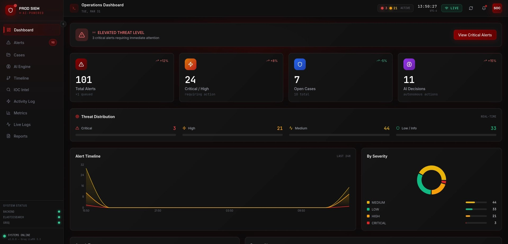
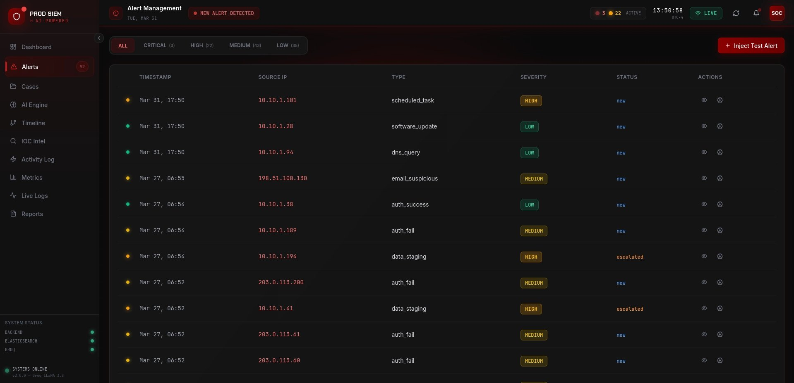
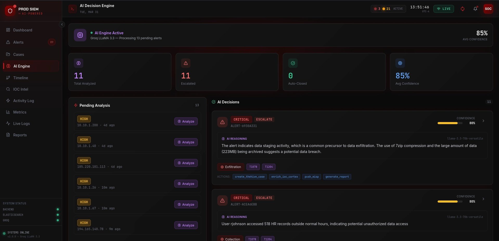
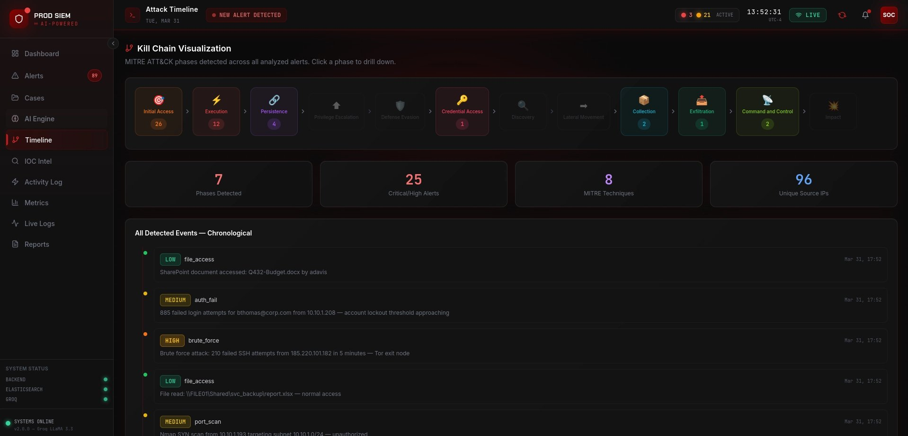
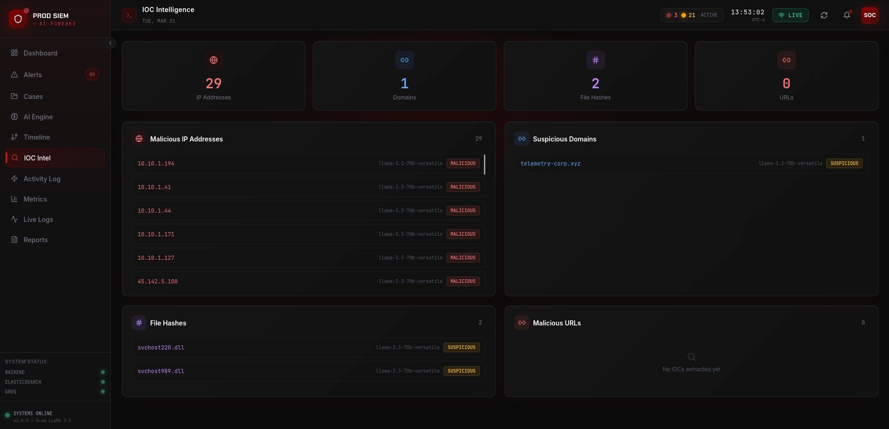
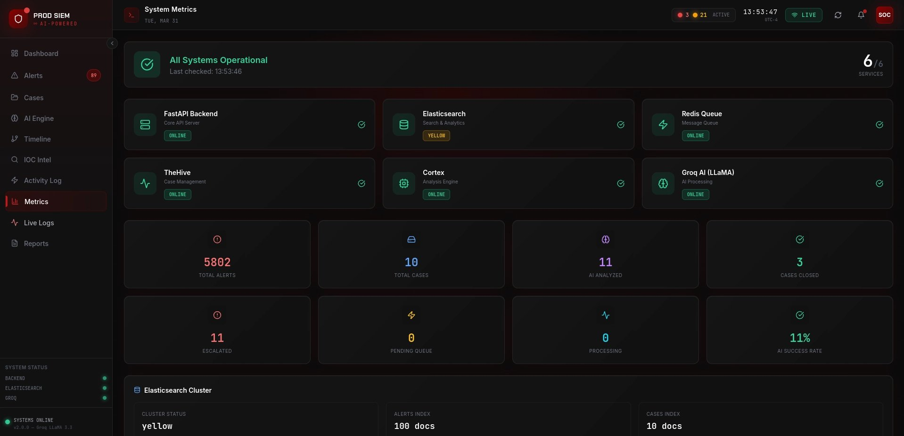

<div align="center">

# prod-siem

### AI-Powered SOC SIEM Platform

*Real-time security alerting, MITRE ATT&CK kill-chain correlation, and LLM-driven triage — self-hosted, one command.*


</div>

---

## What This Is

**prod-siem** is a self-hosted SIEM/SOC platform that ingests security events, correlates them against the MITRE ATT&CK framework, and uses Groq's LLaMA 3.3 70B to automatically triage alerts — producing a verdict, confidence score, reasoning, and recommended SOAR actions for every alert.

Most SOC analysts spend the bulk of their time on the first pass of triage: reading context, deciding severity, choosing a playbook. This project automates that first pass so a human analyst only sees alerts that already have a machine verdict attached.

Built as a portfolio project by a cybersecurity practitioner. It is **not** production-hardened (see [Known Limitations](#known-limitations)), but every component — ingestion, correlation, AI triage, case management, SOAR playbooks, the React dashboard — works end-to-end and runs locally with one command.

---

## Screenshots

> Real captures from a live simulation run. The platform ships with a continuous alert generator across 32 attack scenarios.

| Operations Dashboard | Alert Management |
| --- | --- |
|  |  |
| Threat-level overview, severity distribution, alert timeline, AI decision counter. | Real-time alert feed with severity tags, status tracking, and test-inject controls. |

| AI Decision Engine | Kill Chain Timeline |
| --- | --- |
|  |  |
| Per-alert LLM reasoning with confidence scores and recommended SOAR actions. | MITRE ATT&CK kill-chain visualization across all correlated events. |

| IOC Intelligence | System Metrics |
| --- | --- |
|  |  |
| Aggregated indicators (IPs, domains, hashes) extracted across all cases. | Component health for all services plus Elasticsearch cluster state. |

---

## Architecture

```
                ┌───────────────────────┐
                │   SOC Simulation      │  generates synthetic alerts
                │   (32 attack types)   │  across the MITRE kill-chain
                └──────────┬────────────┘
                           │
                           ▼
   ┌─────────────────────────────────────────────────┐
   │  FastAPI Backend  (main.py)                     │
   │  ┌───────────────────────────────────────────┐  │
   │  │  Ingestion → Correlation → Enrichment     │  │
   │  │            ↓                              │  │
   │  │  AI Triage Engine (Groq LLaMA 3.3 70B)   │  │
   │  │            ↓                              │  │
   │  │  SOAR Playbook Dispatcher                 │  │
   │  └───────────────────────────────────────────┘  │
   └────┬───────────────┬─────────────┬──────────────┘
        │               │             │
        ▼               ▼             ▼
  ┌──────────┐    ┌──────────┐   ┌──────────────┐
  │   ES     │    │  Redis   │   │ Integrations │
  │ alerts/  │    │  cache + │   │ TheHive,     │
  │ cases/   │    │  pub/sub │   │ Cortex, MISP │
  │ events   │    │          │   │              │
  └──────────┘    └─────┬────┘   └──────────────┘
                        │
                        ▼ WebSocket fan-out
                ┌───────────────────────┐
                │  React 18 + Vite UI   │  10 views, dark terminal
                │  (dark terminal)      │  theme, real-time updates
                └───────────────────────┘
```

---

## Tech Stack

| Layer | Technology | Purpose |
| --- | --- | --- |
| Backend | FastAPI 0.115, Uvicorn | Async HTTP + WebSocket server |
| Storage | Elasticsearch 8.13 | Alert, case, and event indexes |
| Cache / Queue | Redis 7.2 | Caching, alert queue, WebSocket pub/sub |
| AI | Groq API + LLaMA 3.3 70B | Alert triage, verdict, and reasoning |
| Frontend | React 18 + Vite + Tailwind | 10-page dark-theme SOC dashboard |
| Case Mgmt | TheHive 5.3 | Incident case lifecycle (optional) |
| Analyzers | Cortex 3.1 | IOC analyzer execution (optional) |
| Threat Intel | MISP | IOC enrichment (optional) |
| Reports | ReportLab | PDF incident reports |
| Infra | Docker Compose | One-command infrastructure |

---

## Prerequisites

- Docker + Docker Compose v2
- Python 3.11+ (tested on 3.11, 3.12, 3.13)
- Node.js 18+ and npm
- A free [Groq API key](https://console.groq.com/keys) (optional — AI triage disables gracefully without it)
- ~4 GB free RAM (8 GB if running TheHive/Cortex with `--full`)

Tested on Kali Linux 2024 and Ubuntu 22.04+.

---

## Quick Start

```bash
# 1. Clone
git clone https://github.com/aadarshkadam067/prod-siem.git
cd prod-siem

# 2. Configure
cp .env.example .env
nano .env                       # paste your GROQ_API_KEY

# 3. Start (one command)
chmod +x setup.sh
./setup.sh
```

When it finishes:

```
  Frontend:       http://localhost:5173
  Backend API:    http://localhost:8000
  API docs:       http://localhost:8000/docs
```

Open the frontend. Alerts start generating automatically. Click **"Inject Test Alert"** on the Alerts page to trigger the full pipeline manually.

To stop: `./setup.sh --stop`

### Full SOAR Stack (optional)

```bash
./setup.sh --full               # adds TheHive + Cortex + Cassandra (~8 GB RAM)
```

---

## Project Structure

```
prod-siem/
├── main.py                      # FastAPI app — 15 endpoints, WebSocket, lifespan
├── ai_engine/                   # Groq LLM triage, prompt templates, action executor
│   ├── decision_engine.py       # Core AI analysis logic
│   ├── action_executor.py       # SOAR action dispatch
│   ├── prompts.py               # LLM prompt templates
│   └── claude_analyst.py        # Analyst interface
├── detection_engine/            # Alert correlation engine
│   └── correlation.py           # MITRE ATT&CK mapping + rule matching
├── soc_workflow/                # Case lifecycle management
│   └── case_manager.py          # Create, escalate, close cases
├── soc_simulation/              # Synthetic alert generation
│   ├── continuous_generator.py  # 32-scenario event generator
│   └── apt_simulator.py         # APT campaign simulation
├── integrations/                # External platform clients
│   ├── thehive_client.py        # TheHive case sync
│   ├── cortex_client.py         # Cortex analyzer dispatch
│   └── misp_client.py           # MISP threat intel
├── incident_response/           # SOAR + reporting
│   └── report_generator.py      # ReportLab PDF generation
├── frontend/                    # React 18 + Vite + Tailwind
│   └── src/pages/               # 10 views (Dashboard, Alerts, AI, Timeline...)
├── scripts/setup_indexes.py     # Elasticsearch index bootstrapping
├── docker-compose.yml           # ES + Redis default; TheHive/Cortex via --full
├── setup.sh                     # One-command setup with preflight checks
├── run.sh                       # Dev workflow: backend + AI engine
├── health_check.sh              # Component-by-component verification
├── stop.sh                      # Graceful shutdown
├── requirements.txt             # Pinned Python deps with comments
└── .env.example                 # Env template — copy to .env
```

---

## API Endpoints

Interactive Swagger UI at **http://localhost:8000/docs** after starting.

| Method | Path | Description |
| --- | --- | --- |
| `GET` | `/health` | Liveness probe |
| `WS` | `/ws` | Real-time alert + activity stream |
| `POST` | `/api/v1/alerts/ingest` | Ingest a new alert |
| `GET` | `/api/v1/alerts` | List alerts (filterable) |
| `POST` | `/api/v1/ai/analyze/{alert_id}` | Trigger AI triage on an alert |
| `GET` | `/api/v1/cases` | List incident cases |
| `GET` | `/api/v1/cases/{case_id}` | Case detail |
| `POST` | `/api/v1/cases/{case_id}/notes` | Add analyst note |
| `POST` | `/api/v1/cases/{case_id}/close` | Close with resolution |
| `GET` | `/api/v1/cases/{case_id}/report` | Generate PDF incident report |
| `GET` | `/api/v1/cases/{case_id}/iocs` | Extracted IOCs for case |
| `GET` | `/api/v1/stats` | Dashboard aggregate stats |
| `GET` | `/api/v1/metrics` | System metrics |
| `GET` | `/api/v1/activity` | Recent activity log |
| `GET` | `/api/v1/system/status` | Component health status |

### Example: ingest + triage

```bash
# Ingest
curl -X POST http://localhost:8000/api/v1/alerts/ingest \
  -H "Content-Type: application/json" \
  -d '{"event_type":"brute_force","severity":"high","source_ip":"185.220.101.45","target_user":"admin","attempts":273}'

# AI triage (replace ALERT-xxx with the returned alert_id)
curl -X POST http://localhost:8000/api/v1/ai/analyze/ALERT-xxx
```

---

## Alert Scenarios

32 scenarios spanning the MITRE ATT&CK kill-chain, generated continuously by the SOC simulation engine:

| Scenario | Tactic | Technique |
| --- | --- | --- |
| `brute_force` | Credential Access | T1110 |
| `password_spray` | Credential Access | T1110.003 |
| `credential_dump` | Credential Access | T1003 |
| `kerberoasting` | Credential Access | T1558.003 |
| `golden_ticket` | Credential Access | T1558.001 |
| `dcsync_attack` | Credential Access | T1003.006 |
| `email_phishing` | Initial Access | T1566 |
| `impossible_travel` | Initial Access | T1078.004 |
| `auth_fail` / `auth_success` | Initial Access | T1078 |
| `vpn_connect` | Initial Access | T1133 |
| `usb_connect` | Initial Access | T1200 |
| `macro_blocked` | Execution | T1204.002 |
| `powershell_exec` | Execution | T1059.001 |
| `malware_detected` | Execution | T1204 |
| `scheduled_task_abuse` | Persistence | T1053.005 |
| `persistence_registry` | Persistence | T1547.001 |
| `software_install` | Persistence | T1574 |
| `new_local_admin` | Privilege Escalation | T1136.001 |
| `port_scan` | Discovery | T1046 |
| `scheduled_scan` | Discovery | T1518 |
| `dns_query` | Command & Control | T1071.004 |
| `lateral_movement` | Lateral Movement | T1021 |
| `wmi_lateral_movement` | Lateral Movement | T1021.006 |
| `rdp_session` / `rdp_external` | Lateral Movement | T1021.001 |
| `data_staging` | Collection | T1074 |
| `sensitive_file_access` / `file_access` | Collection | T1005 |
| `data_exfiltration` | Exfiltration | T1041 |
| `ransomware_indicator` | Impact | T1486 |
| `certificate_expiry` | Operational | — |

---

## Known Limitations

This section exists because honesty about boundaries matters more than marketing language:

- **No authentication on the backend.** Every endpoint is open. Fine for localhost; do not expose to a network.
- **In-memory activity log.** Backend restart loses recent activity (alerts and cases persist in Elasticsearch).
- **TheHive/Cortex integration is best-effort.** If TheHive isn't running, case sync silently degrades — no retry queue.
- **Single-tenant.** One org assumption baked into ES index names.
- **AI uses a single prompt template** — no fine-tuning, no RAG, no feedback loop.
- **Frontend runs via `vite dev`** — no production build or static bundling.
- **No rate limiting** on the AI endpoint — a tight loop will exhaust your Groq quota.
- **Tests directory is a placeholder** — test coverage does not exist yet.

---

## Roadmap

- [ ] JWT authentication + role-based access control
- [ ] Production frontend build + reverse proxy
- [ ] Analyst feedback loop for AI verdicts (correct/wrong → prompt tuning)
- [ ] Sigma rule hot-reload from `detection_engine/`
- [ ] Persistent activity log in Redis Streams
- [ ] Actual test suite in `tests/`
- [ ] OpenTelemetry tracing
- [ ] Helm chart for k8s deployment

---

## License

MIT — see [LICENSE](LICENSE).

---

<div align="center">

Built by **[Aadarsh Kadam](https://github.com/aadarshkadam067)**

</div>
